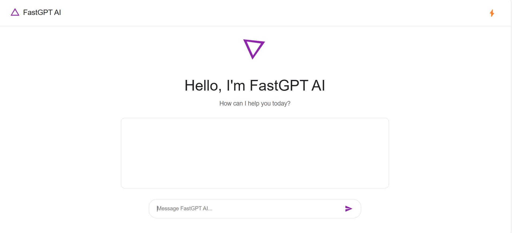
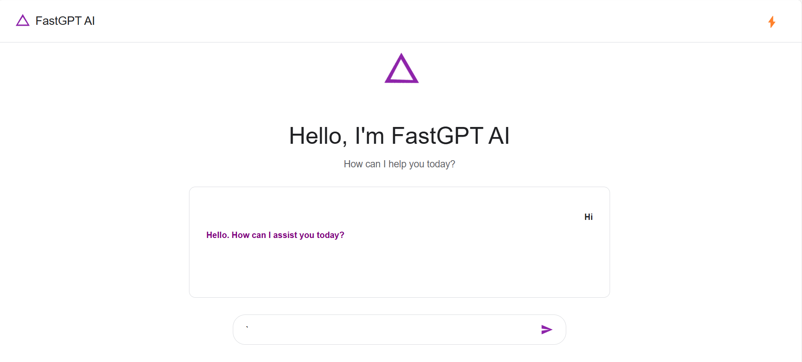

# <i>
# FastGPT AI
# Description:
<i>FastGPT is a free, open-source implementation of the GPT architecture that requires no account and offers unlimited usage. It provides rapid text generation and high performance through an easy-to-use API. 

# Links: 
<b>FastGPT AI: [Live Demo](https://fastgptai.netlify.app/)

# Screenshots:

# FastGPT UI

